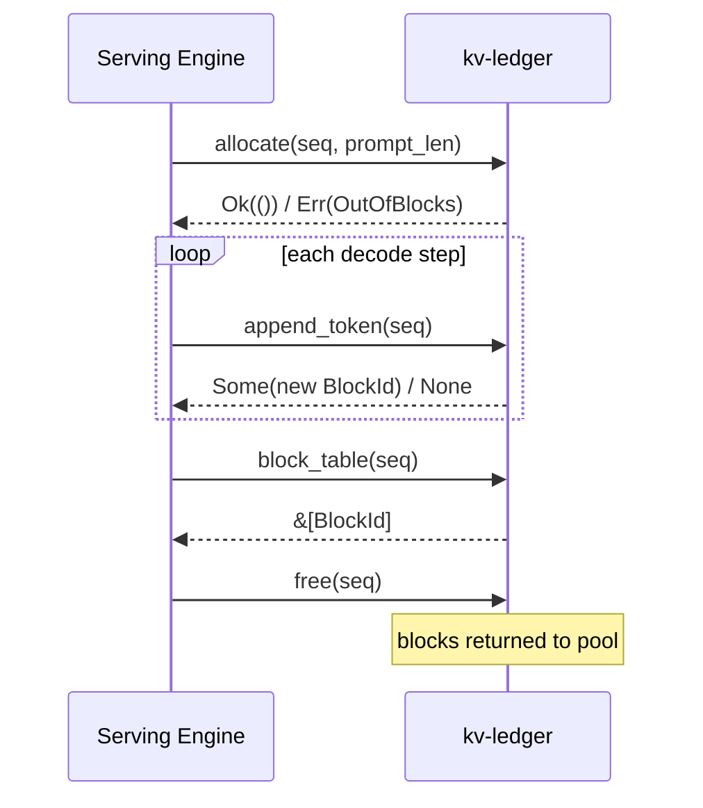

# kv-ledger

> [!IMPORTANT]
> WIP

A `no-std + alloc` Rust library.
This library implements the block management layer of `PagedAttention`.

In `PagedAttention`, the KV cache of each request is stored in fixed-size blocks scattered across memory, which reduces memory waste and fragmentation.

## Bookkeeping

This project is the bookkeeper for this:

It tracks which blocks are free, assigns them to requests as they arrive and generate tokens, and reclaims them when requests finish.

A serving engine integrates by calling `allocate` when admitting a request, `append_token` each decode step, and `free` when the request completes.

> [!NOTE]
> This project only tracks blocks: it does not perform the actual memory allocation. The serving engine is responsible for the physical allocation based on the block indices provided.

## Alternatives

An alternative to this approach is using the GPU's MMU to handle paging, as done with [vAttention](https://github.com/microsoft/vattention).
